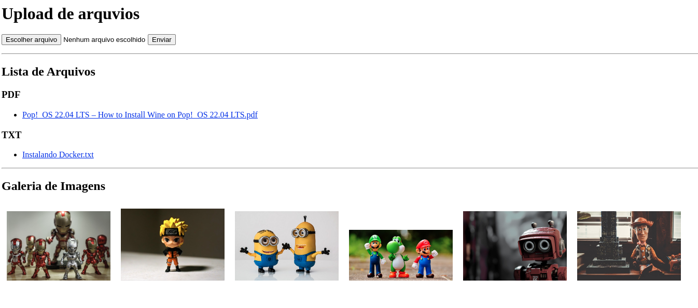

  

### **Você pode fazer o upload de arquivos e o sistema faz a organização, montando uma galeria de imagens e organizando os arquivos de texto de acordo com sua extensão.**

Este é um script em Python que cria uma aplicação web Flask para upload de arquivos e exibição de uma lista de arquivos carregados pelo usuário. Quando o script é executado, inicia um servidor web local na porta 8080 que ouve solicitações recebidas.

A aplicação web tem dois endpoints:

1. `/` - Este endpoint aceita solicitações GET e POST. Se uma solicitação GET for feita, ele retorna uma página HTML contendo um formulário de upload de arquivo e uma lista de arquivos carregados pelo usuário. Se uma solicitação POST for feita, ele salva o arquivo carregado no diretório "arquivos" e retorna uma mensagem de sucesso com um link para voltar à página inicial.

2. `/arquivos/<filename>` - Este endpoint permite que os usuários baixem arquivos carregados do diretório "arquivos" especificando o nome do arquivo na URL.

O script define duas funções auxiliares:

1. `get_file_list()` - Esta função lê o diretório "arquivos" e agrupa todos os arquivos por sua extensão de arquivo (.pdf, .txt, .jpg ou .jpeg). Em seguida, retorna uma string formatada em HTML com a lista de arquivos agrupados por extensão de arquivo.

2. `get_image_gallery()` - Esta função lê o diretório "arquivos" e filtra todos os arquivos de imagem (.jpg ou .jpeg). Em seguida, retorna uma string formatada em HTML com uma galeria de todas as imagens com links clicáveis para visualizar a imagem em tamanho real.

Quando o script é executado, inicia a aplicação Flask na máquina local e ouve solicitações recebidas na porta 8080.